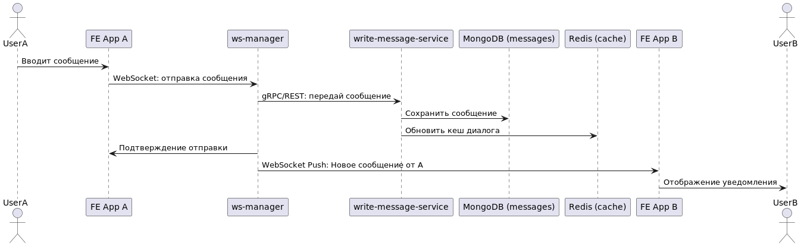
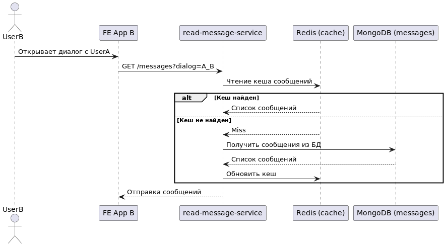
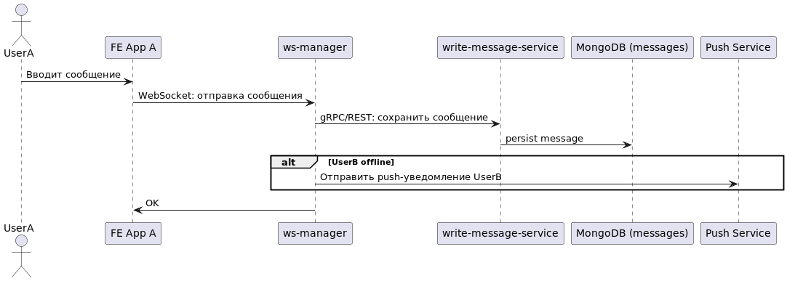
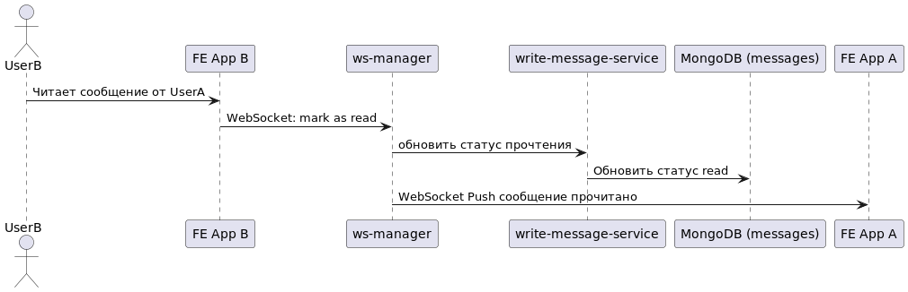

# Задание
Проектирование и архитектурное решение высоконагруженной системы онлайн-чата

# Описание проблемы
## Контекст
* Высокотехнологичная компания участвует в тендере на импортозамещение мессенджера телеграмм. 
* Необходимо создать мессенджер, который будет юридически соответствовать российскому законодательству, интегрирован с экосистемой российского веба, умная блокировка фрод и спам аккаунтов на базе технологий ИИ, встроенная система оплаты и денежных переводов, автономная установка на собственные сервера

## Бизнес цели
* Система должна быть зарегистрирована в реестре российского ПО с полным соблюдением правил
* Возможность шифрования сообщений
* Возможность анализировать любые сообщения и комментарии третьей стороной
* Возможность автоматической модерации постов, сообщений, комментариев, профилей
* Возможность автоматического выявления угроз

## Архитектурные драйверы
* Высокие нагрузки, сотни тысяч пользователей, миллионы сообщений
* Анализ огромного количества сообщений на основе технологий Big Data и AI, онлайн выявление угроз
* Соблюдение стандартов и законодательства России
* Функционирование системы на собственном железе
* Поддержка всех популярных платформ и ОС: мобайл, десктоп, веб

## Ограничения технологические и бизнесовые
* Бюджет ограничен 1млрд руб
* Соблюдение требований ФСБ и ФСТЭК
* География работы приложения: территория России, Белоруссии, Казахстана
* Бесплатное использование для обычных пользователей

# Описание требований
## Пользовательские сценарии
* Два пользователя общаются друг с другом. Обмениваются текстом, голосом, медиа-файлами
* Владелец канала, на который подписано 1м человек, публикует пост с медиа-файлом и ссылками
* Пользователь просматривает комментарии к посту, долистывает до последнего, оставляет свой
* Пользователи общаются в чате
* Пользователь блокирует другого пользователя и сообщает о спаме или фроде
* Пользователь создаёт второй аккаунт, переключается между аккаунтами в настройках профиля
* Пользователь записывает голосовое сообщение и отправляет в чат
* Пользователь звонит другому пользователю по видео-связи

## Нефункциональные требования
1. [ ] Доступность: 99.99% (~4мин в месяц)
2. [ ] Производительность: p99 200мс, p95 100мс для отправки и получения текстовых сообщений. При пиковых нагрузках возможны ухудшения времени ответа до 1000мс.
3. [ ] Отказоустойчивость: при отказе узлов, система должна продолжать работать
4. [ ] Безопасность: 2ф аутентификация, сквозное шифрование сообщений алгоритмами ГОСТ, разграничение прав доступа по ролевой моделе
5. [ ] Надежность: RTO=30мин, RPO=2мин
6. [ ] Наблюдаемость: система мониторинга метрик, позволяющая в реал-тайме следить за здоровьем систимы и уведомлять поддержку в случае отклонений. Должны собираться логи и трэйсы, позволяющие диагностировать проблемы в работе системы
7. [ ] Модифицируемость: система должна быть расширяема и легко модифицируема
8. [ ] Масштабируемость: система должна горизонтально масштабироваться в случае увеличения нагрузки
9. [ ] Целостность данных: eventual consistency с лагом не более 2сек (за счет ас)
10. [ ] Кросплатформенность: фронт системы должен работать на всех популярных платформах (веб, мобайл, desktop, windows, mac, linux)
11. [ ] Географическая распределенность: система должна учитывать охват всех часовых поясов России
12. [ ] Автономность: систему можно установить на собственные сервера
13. [ ] Compliance: соответствие федеральным законам и стандартам регуляторов: ФСБ, ФСТЭК, Роскомнадзор
14. [ ] Юридическая прозрачность: предоставление доступа к информации по запросам в соответсвии с законодательством
15. [ ] Резервное копирование и аварийное восстановление: система должна восстанавливаться после внешних аварийных воздействий, должно быть реализовано инкрементальное бэкапирование критичных данных раз в 6 часов, раз в сутки должно быть полное бэкапирование системы с защищенным географически отделенным хранением бэкапа 

# Описание решения
## Принятые ключевые архитектурные решения
1. Несколько географически распределенных цодов, шардированная бд, брокеры кафки разнесенные по разным цодам, балансировщики haproxy, использование zookeeper для дискавери серверов и консенсуса
2. База данных сообщений делится на 3: private message, chat message, channel publications для того чтобы обеспечить отказоустойчивость, производительность доступа к историческим данным, а также для реализации паттерна bulkhead.
3. Используем современный подход token based авторизации с использованием OIDC токенов
4. Запрос на сервер для установки wss соединения проходит через Load balancer и api gateway. Именно на этих узлах проверяется наличие и валидность токена. После того как соединение установлено, сервер периодически запрашивает access токен для валидации, если токен невалиден соединение закрывается.
5. Приложение хранит пару токенов в локальном зашифрованном хранилище: на Linux это libsecret или keyring, на MacOS - keychain
6. Локальное хранилище где хранятся токены зашифровано, если его скопировать средствами ОС, то расшифровать невозможно. Однако само приложение, где юзер успешно авторизован, может доставать от туда access и refresh токены, т.к. ОС авторизует приложение по цифровой подписи и хэшу бинарника.
7. Основные узлы пути запроса: FE app -> Load balancer -> waf (опционально) -> api gateway -> микросервис на бэке
8. Реализация дополнительного тракта от write-message-service до бд user chat list через кафку. Это дублирующий поток, нужен для резервной передачи событий.

## Контекстная диаграмма

## Диаграмма контейнеров

## Диаграмма развертывания

## Диаграммы последовательности
### Диаграмма 1: Отправка сообщения от UserA к UserB

### Диаграмма 2: UserB открывает диалог и загружает сообщения

### Диаграмма 3: Доставка push-уведомления, если FE_B не в сети

### Диаграмма 4: Подтверждение прочтения сообщения

## Лог архитектурных решений (ADL, ADR)
### ADR №1: Дублирующий тракт передачи событий через Kafka

**Статус:** Принято

**Дата:** 02.04.2025

**Контекст:**
Для высоконагруженного мессенджера критически важна надёжность передачи данных, особенно для состояния списка чатов пользователя (`user chat list`). В случае потери событий пользователи могут получать некорректные счетчики сообщений и устаревшие данные.

**Решение:**
Принято решение реализовать дополнительный (резервный) тракт передачи событий из `write-message-service` в БД `user chat list` через брокер Kafka.

**Причины:**
- Повышение надежности доставки событий.
- Асинхронность и возможность временной буферизации данных.
- Минимизация вероятности потери данных в случае отказа основного канала связи.

**Последствия:**
- Увеличение сложности архитектуры из-за дополнительного компонента.
- Требование мониторинга Kafka для оперативного выявления проблем.

### ADR №2: Разделение баз данных сообщений на несколько специализированных коллекций

**Статус:** Принято

**Дата:** 02.04.2025

**Контекст:**
Единая база данных сообщений при росте нагрузки может стать узким местом с точки зрения производительности и отказоустойчивости.

**Решение:**
Принято решение разделить хранилище сообщений на три отдельные MongoDB базы данных с соответствующими специализированными коллекциями:

- `private message` – хранение личных диалогов между двумя пользователями.
- `chat message` – хранение сообщений в групповых чатах с множеством участников.
- `channel publications` – хранение публикаций и постов из каналов.

**Причины:**
- Реализация паттерна Bulkhead для ограничения зоны возможного сбоя.
- Оптимизация производительности за счёт независимого масштабирования каждой коллекции.
- Повышение скорости выборок и вставок благодаря узкоспециализированному индексированию и шардированию данных.

**Последствия:**
- Усложнение инфраструктуры из-за необходимости поддержки нескольких отдельных кластеров баз данных.
- Более тонкое управление ресурсами и настройками шардирования.

